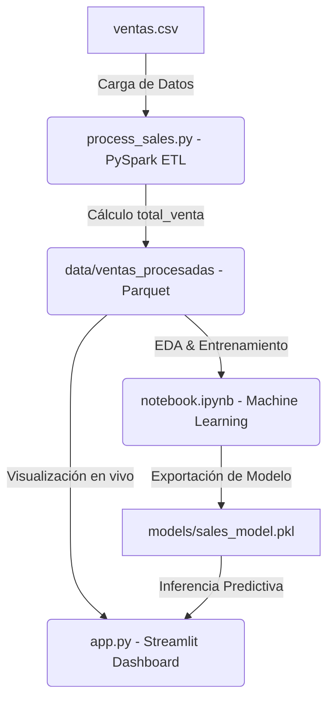

# 📊 Pipeline de Ventas Big Data: PySpark, ML & Streamlit Dashboard

<div align="center">


</div>

---

## 🛠️ Arquitectura del Pipeline de Datos



---

## 📋 Requisitos del Sistema

Antes de iniciar la ejecución del proyecto, asegúrate de contar con los siguientes elementos instalados:

1. **Python 3.8+**
2. **Java Development Kit (JDK) 8 o 11** (Requerido por PySpark en Windows/Mac/Linux).
3. **Apache Spark** (Gestionado automáticamente a través de la librería `pyspark` de pip).
4. Las dependencias del proyecto especificadas en la sección de instalación.

---

## 🚀 Guía de Instalación y Configuración Paso a Paso

### Paso 1: Clonar/Acceder al Espacio de Trabajo
Accede al directorio del proyecto en la terminal:
```bash
cd c:/Users/Catherine/Desktop/pyspark
```

### Paso 2: Crear un Entorno Virtual (Recomendado)
Para mantener limpias las dependencias de tu sistema:
```bash
python -m venv venv
# Activar en Windows
venv\Scripts\activate
# Activar en macOS/Linux
source venv/bin/activate
```

### Paso 3: Instalar Dependencias del Sistema
Ejecuta la siguiente instrucción para instalar las librerías necesarias:
```bash
pip install pyspark streamlit pandas plotly scikit-learn pyarrow
```

---

## 💻 Ejecución de Componentes

### 1. El Pipeline ETL con PySpark (`process_sales.py`)

Este script ejecuta el procesamiento en paralelo de los datos en disco:
1. **Inicializa la sesión de Spark** estableciendo el nivel de log adecuado para evitar alertas innecesarias.
2. **Carga el CSV** `data/ventas.csv` infiriendo dinámicamente los tipos de datos (esquema) y cargando las cabeceras.
3. **Calcula la nueva columna** `total_venta` mediante la fórmula: `cantidad * precio`.
4. **Muestra el DataFrame resultante** en consola para validación del desarrollador.
5. **Escribe en formato Parquet columnar** con compresión en `data/ventas_procesadas/` utilizando el modo de sobreescritura (`overwrite`).

Para ejecutar el script ETL, utiliza el siguiente comando en tu consola activa:
```bash
python process_sales.py
```

*Salida Esperada en Consola:*
```text
==============================================================
Iniciando el Pipeline ETL con PySpark...
==============================================================
1. Cargando el archivo CSV desde: data/ventas.csv...

Esquema de los datos cargados:
root
 |-- id_venta: integer (nullable = true)
 |-- producto: string (nullable = true)
 |-- cantidad: integer (nullable = true)
 |-- precio: integer (nullable = true)

2. Calculando la columna 'total_venta' (cantidad * precio)...

3. Resultado final del procesamiento:
+--------+------------+--------+------+-----------+
|id_venta|producto    |cantidad|precio|total_venta|
+--------+------------+--------+------+-----------+
|1       |Laptop      |2       |2500  |5000       |
|2       |Mouse       |5       |50    |250        |
|3       |Teclado     |3       |120    |360        |
...
4. Guardando los datos procesados en formato Parquet en: data/ventas_procesadas...

¡Pipeline ETL ejecutado con éxito y datos guardados en formato Parquet!
==============================================================
```

---

### 2. Modelado de Machine Learning (`notebook.ipynb`)

El cuaderno realiza el análisis predictivo del negocio:
*   Carga la base de datos procesada en formato **Parquet**.
*   Realiza ingeniería de características codificando la variable categórica `producto` mediante `LabelEncoder`.
*   Aplica una separación de datos de entrenamiento ($80\%$) y prueba ($20\%$).
*   Entrena un regresor **Random Forest (Bosque Aleatorio)** para modelar la elasticidad del precio y estimar cuántas unidades se venderán en función del producto y su precio unitario.
*   Serializa y exporta el modelo y los codificadores a `models/sales_model.pkl`.

Para generar el cuaderno `notebook.ipynb` en tu directorio local y ejecutar el entrenamiento, corre el siguiente script generador:
```bash
python create_notebook.py
```

*Nota: Una vez generado el archivo `notebook.ipynb`, puedes abrirlo con tu entorno Jupyter habitual, VS Code, o Google Colab para visualizar sus celdas ejecutadas.*

---

### 3. Dashboard Interactivo y Predictivo (`app.py`)

La aplicación **Streamlit** proporciona un despliegue visual de alto nivel enfocado en KPIs de negocio e inferencia interactiva:

*   **Ingesta inteligente de datos:** Carga dinámicamente los datos consolidados en Parquet. Si la sesión distribuida de Spark aún no se ha ejecutado en tu máquina local, la aplicación cuenta con un *fallback robusto* que procesa el CSV original en tiempo real, garantizando una disponibilidad del $100\%$.
*   **KPIs en Tiempo Real:** Tarjetas visuales interactivas (Glassmorphism) para Ingresos Totales, Volumen de Unidades, Precios Promedio y el Producto Estrella del negocio.
*   **Gráficos Interactivos con Plotly:**
    *   Diagrama de barras interactivo de ingresos por producto.
    *   Gráfico de dona/torta para evaluar la participación en unidades vendidas de cada artículo.
*   **Simulador de Escenarios Inteligente (ML):** Un panel dedicado donde seleccionas el producto y estableces el precio unitario a través de sliders interactivos. El modelo de Machine Learning precargado estima instantáneamente el volumen de demanda estimado y proyecta las ganancias futuras bajo ese escenario específico.

Para desplegar la aplicación Streamlit de forma local, ejecuta el siguiente comando:
```bash
streamlit run app.py
```

El servidor local se abrirá automáticamente en tu navegador web en la dirección:
`http://localhost:8501`

---

## 🎨 Landing Page del Proyecto (`index.html`)

Para ver la presentación comercial y técnica detallada del proyecto con efectos visuales premium (Modo Oscuro, Glassmorphism, Degradados vibrantes, micro-animaciones y diagramas de flujo interactivos), simplemente haz doble clic en el archivo `index.html` de este directorio o ábrelo directamente en tu navegador preferido:

*   [index.html (Enlace Local)](file:///c:/Users/Catherine/Desktop/pyspark/index.html)

---

## 📂 Resumen de la Estructura de Archivos

*   `data/ventas.csv` - Registro base de ventas (con datos iniciales del parcial y registros extendidos de modelado).
*   `data/ventas_procesadas/` - Carpeta generada por PySpark que contiene la partición Parquet optimizada.
*   `process_sales.py` - Script de Python que ejecuta el pipeline PySpark.
*   `notebook.ipynb` - Cuaderno Jupyter con modelado ML Random Forest.
*   `app.py` - Código fuente del Dashboard de Streamlit.
*   `index.html` - Landing page premium de documentación y arquitectura.
*   `README.md` - Esta documentación técnica y guía paso a paso.
